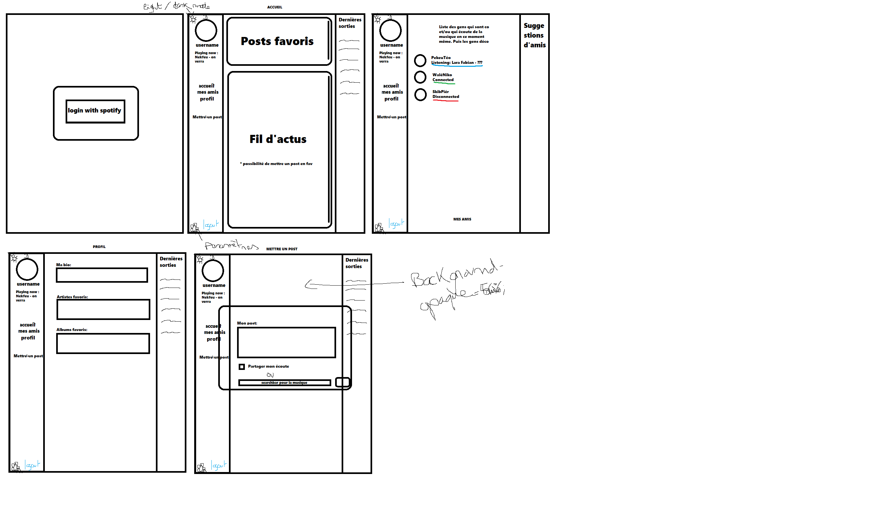

# projetWS

## Authors:

-   HUYGHES Antoine
-   PECQUEUX Théo
-   SKIBINSKI Pierre
-   WALLET Nicolas

## Supervised by:

-   FASQUEL Clément

---

## Useful links

-   [Our Trello](https://trello.com/b/4eynBCyz)
-   ???

---

## Idea:

Social network base on the Spotify API. Similar to soundcloud.

---

## Technologies:

-   NodeJS
-   React (frontend)
-   MongoDB (database)
-   Spotify API
-   ???

---

## Prototype front

## References

Mainly for dev purpose, list of official repo and documentation.

### Client

-   react-spotify-api ([repo](https://github.com/idanlo/react-spotify-api#readme), [doc](https://idanlo.github.io/react-spotify-api/))
-   react-spotify-auth ([repo](https://github.com/kevin51jiang/react-spotify-auth#readme))
-   react-bootstrap-icons ([repo](https://github.com/ismamz/react-bootstrap-icons#readme))
-   js-cookie ([repo](https://github.com/js-cookie/js-cookie#readme))
